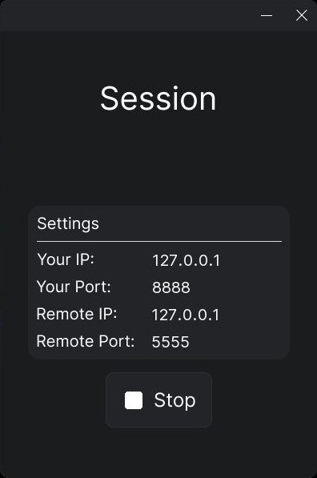

<picture>
  <source media="(prefers-color-scheme: dark)" srcset="https://raw.githubusercontent.com/GiperB0la/Desk/main/Screens/Screen1.jpg">
  <source media="(prefers-color-scheme: light)" srcset="https://raw.githubusercontent.com/GiperB0la/Desk/main/Screens/Screen1.jpg">
  
</picture>

<picture>
  <source media="(prefers-color-scheme: dark)" srcset="https://raw.githubusercontent.com/GiperB0la/Desk/main/Screens/Screen2.jpg">
  <source media="(prefers-color-scheme: light)" srcset="https://raw.githubusercontent.com/GiperB0la/Desk/main/Screens/Screen2.jpg">
  
</picture>

<picture>
  <source media="(prefers-color-scheme: dark)" srcset="https://raw.githubusercontent.com/GiperB0la/Desk/main/Screens/Screen3.jpg">
  <source media="(prefers-color-scheme: light)" srcset="https://raw.githubusercontent.com/GiperB0la/Desk/main/Screens/Screen3.jpg">
  
</picture>

<picture>
  <source media="(prefers-color-scheme: dark)" srcset="https://raw.githubusercontent.com/GiperB0la/Desk/main/Screens/Screen4.jpg">
  <source media="(prefers-color-scheme: light)" srcset="https://raw.githubusercontent.com/GiperB0la/Desk/main/Screens/Screen4.jpg">
  
</picture>
